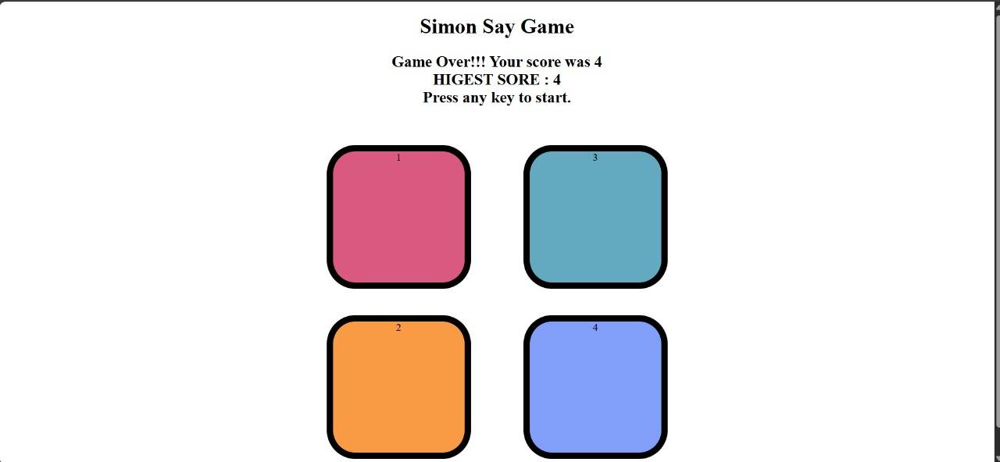

# 🕹️ Simon Says Game

A fun and interactive **"Simon Says"** game built using HTML, CSS, and JavaScript. The game generates a sequence of colors that the player must memorize and repeat. With each successful level, the sequence gets longer. The game ends when the player makes a mistake.

## 🎮 How to Play

1. Open the `Mini_Project.html` file in any modern web browser.
2. Press any key to start the game.
3. Watch the color sequence flash on the screen.
4. Repeat the sequence by clicking the colored buttons in the same order.
5. If you repeat correctly, you advance to the next level.
6. If you make a mistake, the game ends, and your score is displayed.

## 🧠 Features

- Dynamic color sequence generation.
- Button animations for both game and user actions.
- Real-time input verification.
- Level tracking and high score saving (within the session).
- Smooth UI feedback (flashing buttons, background color changes on game over).

## 🛠️ Technologies Used

- **HTML** – for layout and structure.
- **CSS** – for styling buttons and animations.
- **JavaScript** – for game logic and DOM manipulation.

## 📸 Screenshot

## 📬 How to Run

Just open `Mini_Project.html` in your browser. No additional dependencies or build steps required!
